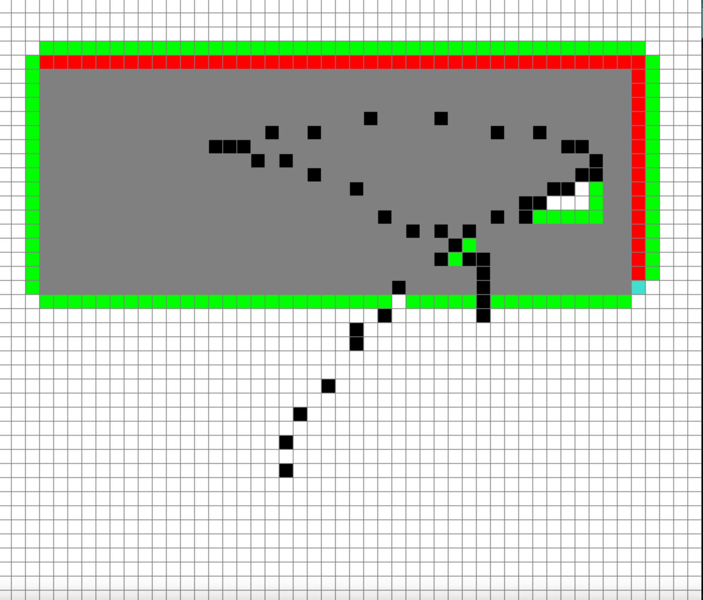

Simulating pathfinding algorithms with pygame 

Required modules
- pygame (pip install pygame or pip3 install pygame)

- Run main (python main.py or python3 main.py)
- First click is start, Second click is End and from third click, drag to add obstacle.
- <space> to start 
- n to clear the grid

